# Component Diagrams Guide

This guide provides visual representations of the HealthAssist Pro notification system components and their interactions using Mermaid.js diagrams.

## Component Architecture

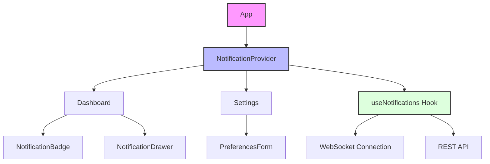

## Data Flow

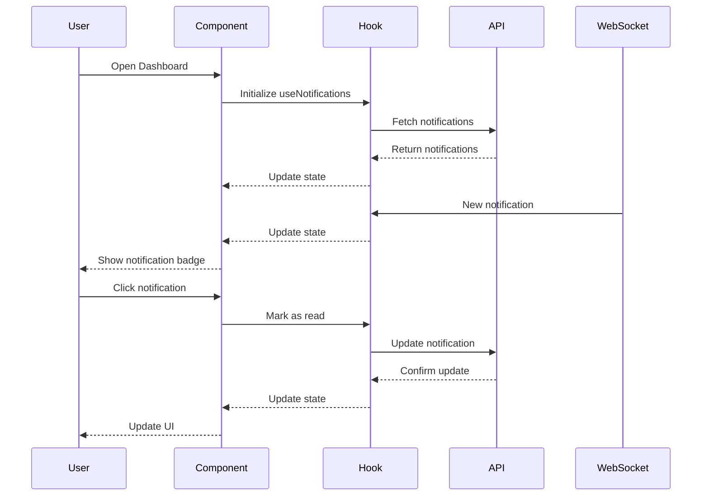

## State Management

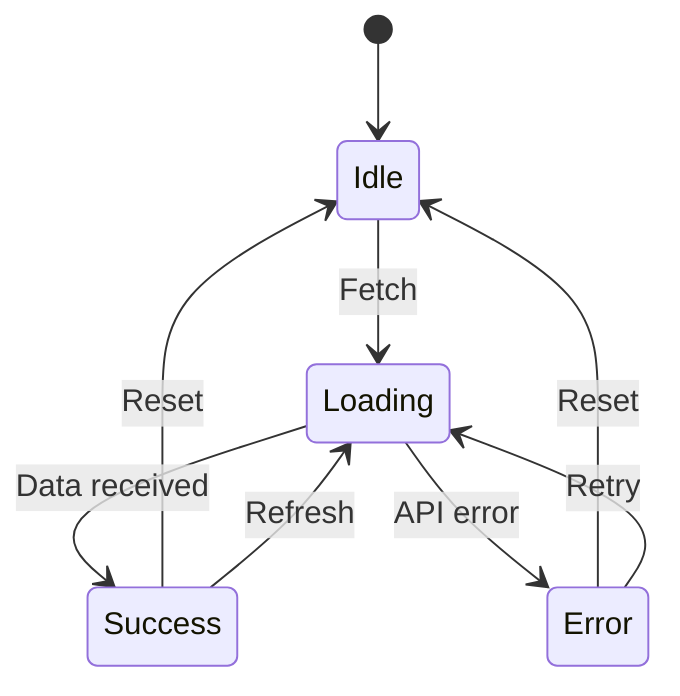

## Notification Lifecycle

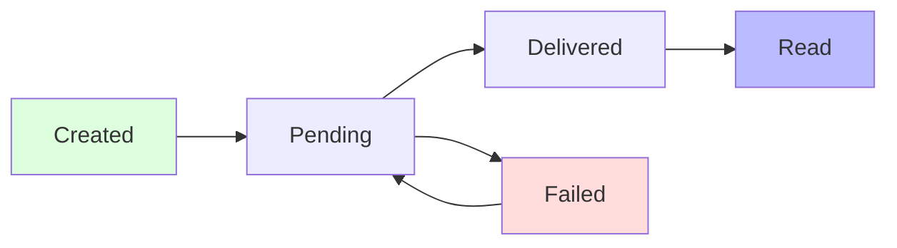

## Component Hierarchy

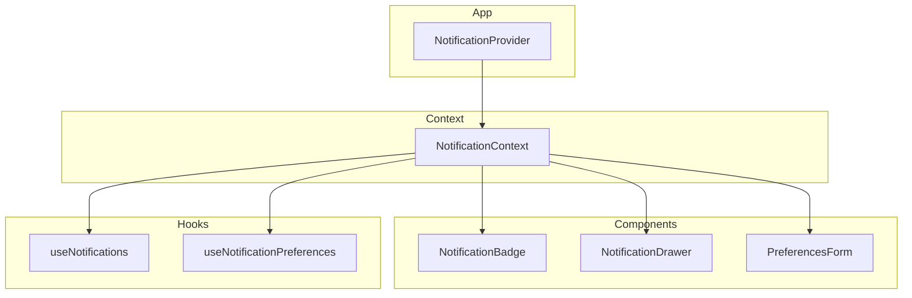

## WebSocket Communication

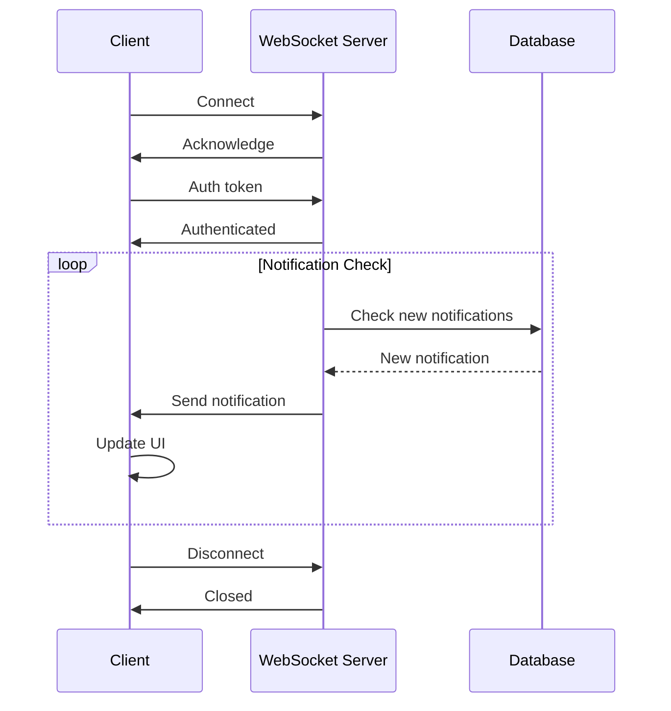

## Error Boundary Flow

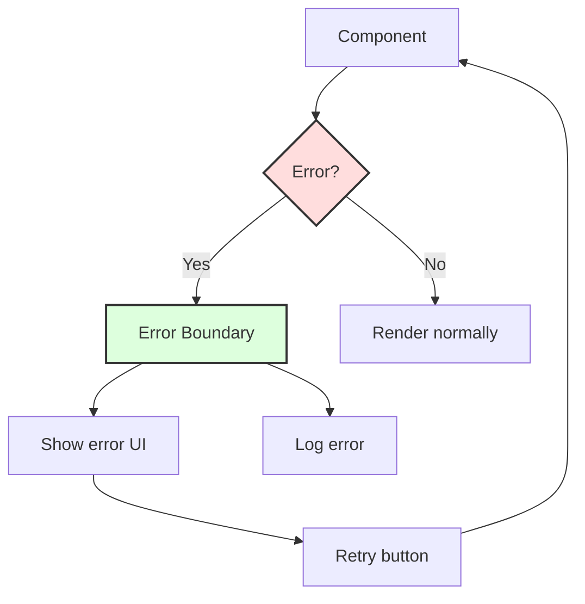

## Preferences Update Flow

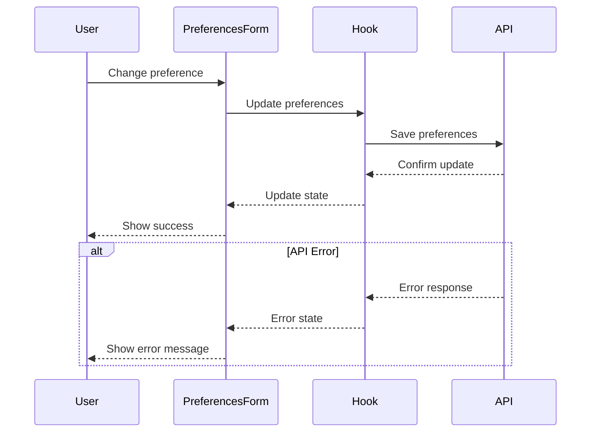

## Component Interaction

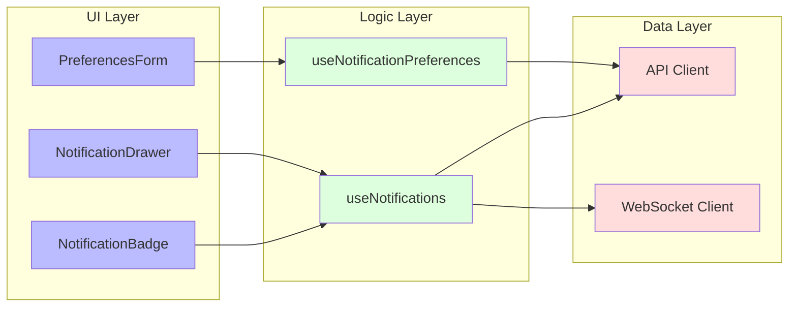

## Testing Strategy

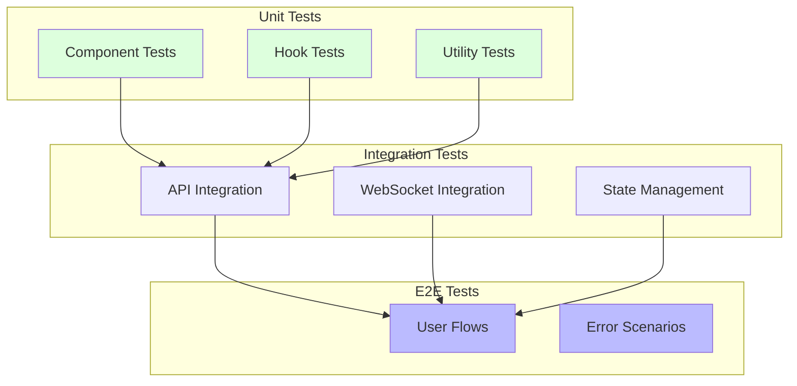

## Performance Monitoring

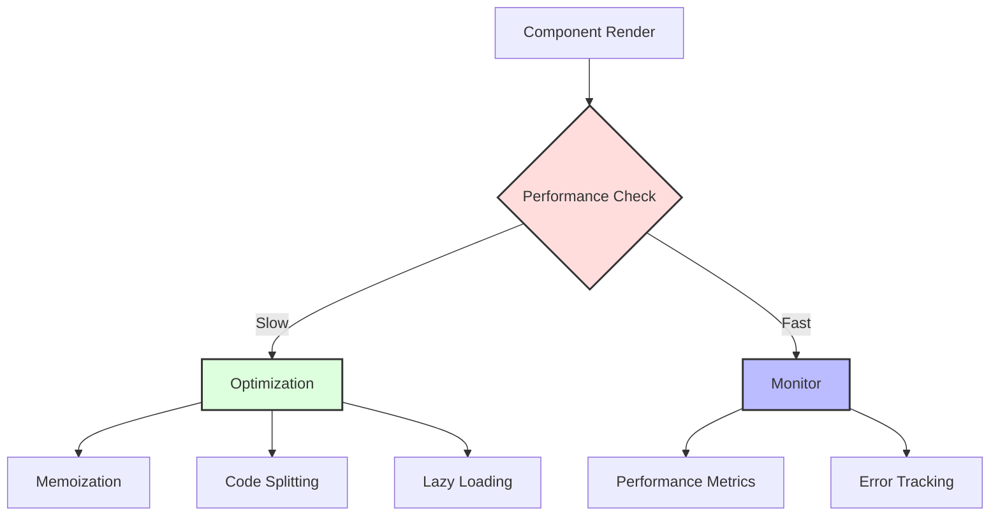

## Example Use Cases

### 1. User Receives and Reads a New Notification

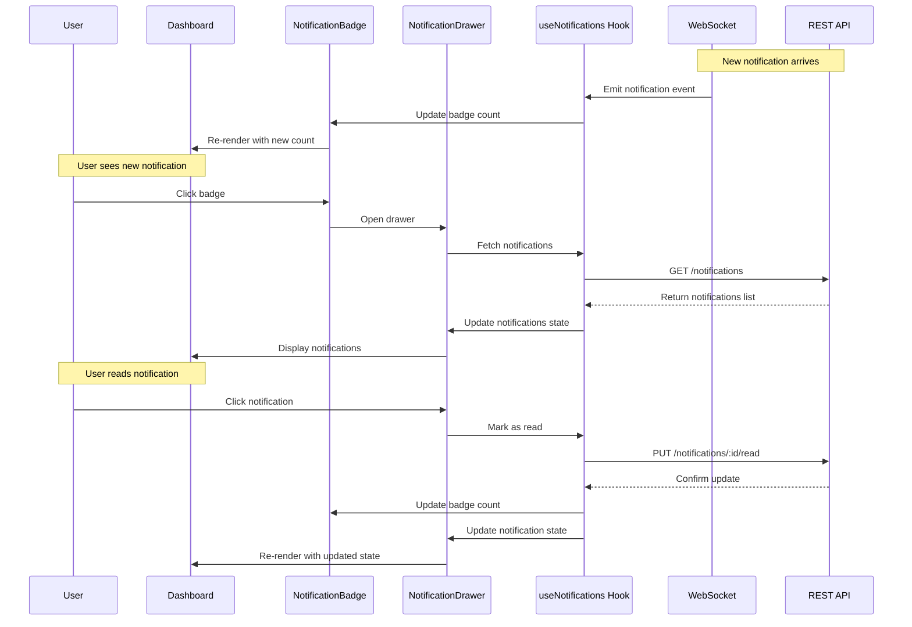

### 2. User Updates Notification Preferences

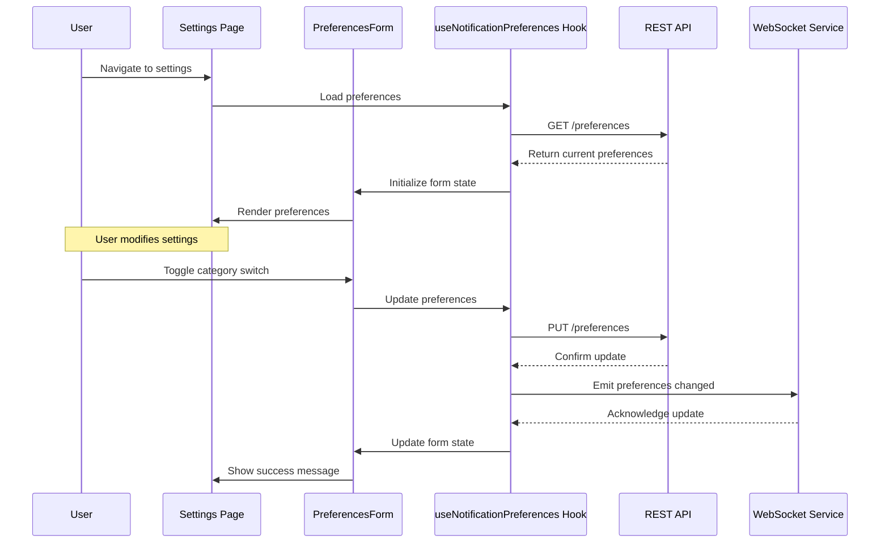

### 3. Quiet Hours Activation Flow

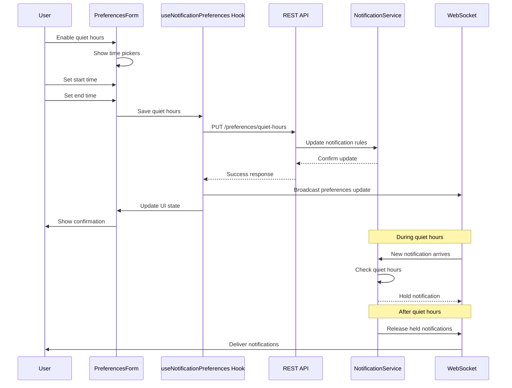

### 4. Error Recovery Scenario

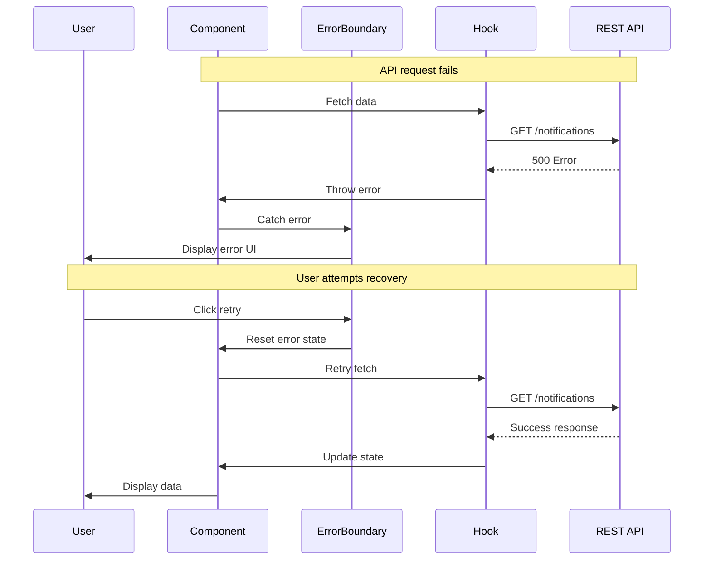

### 5. Real-time Group Notification Flow

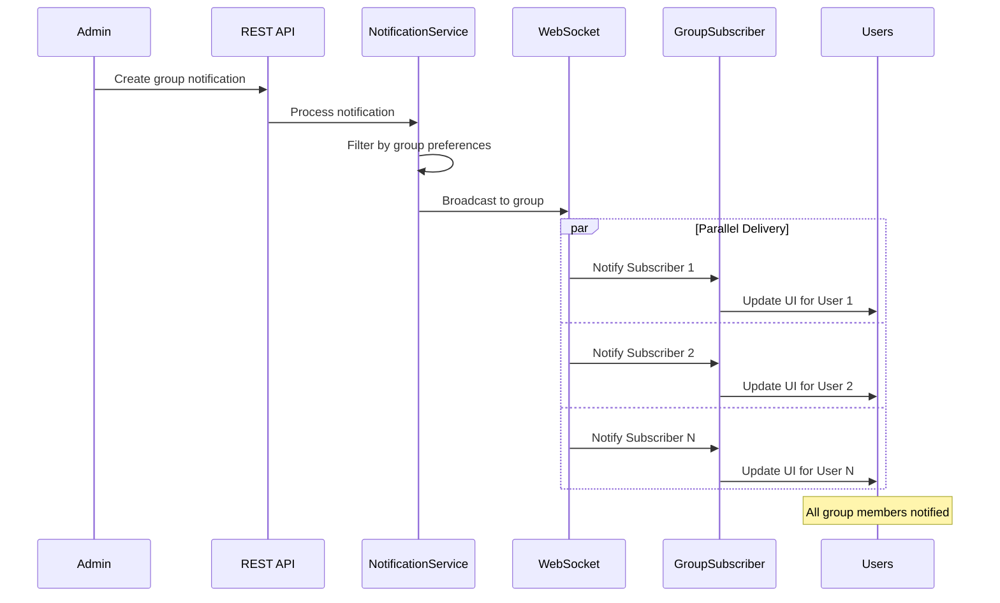

These sequence diagrams illustrate common interaction patterns in the notification system, showing how different components communicate and handle various user scenarios. Each diagram demonstrates the flow of data and actions between the user interface, application logic, and backend services.

These diagrams provide a visual representation of the component architecture, data flow, state management, and other important aspects of the HealthAssist Pro notification system. They can be rendered using any Mermaid.js compatible viewer or documentation system. 