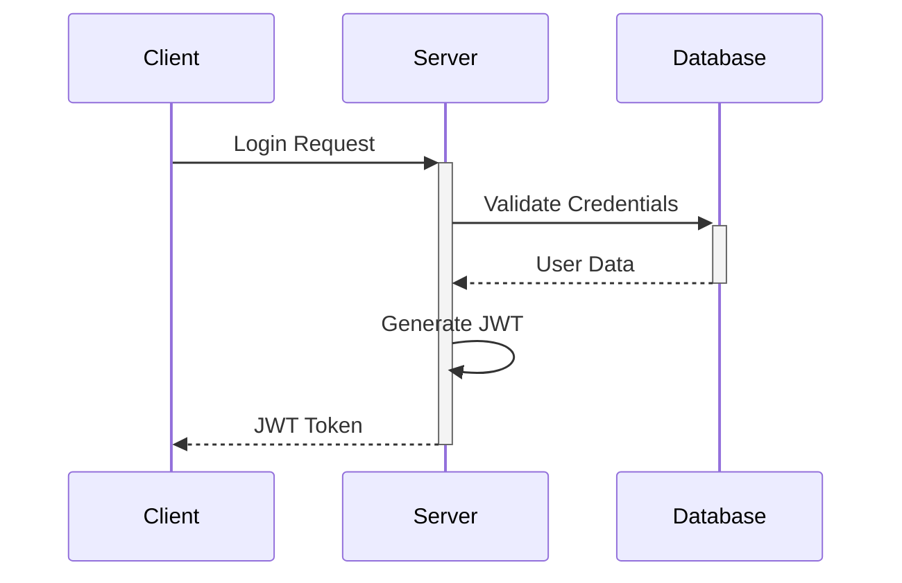
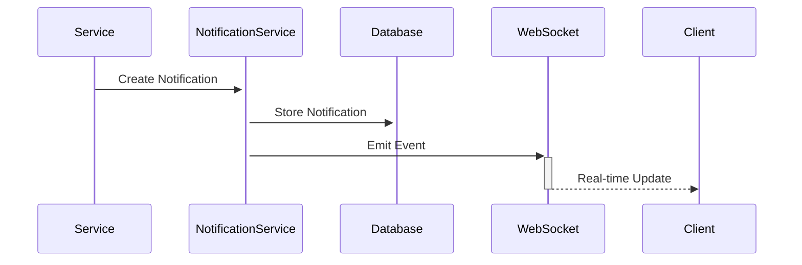

# Technical Architecture

## System Overview

HealthAssist Pro is built using a modern microservices architecture, focusing on scalability, maintainability, and real-time capabilities.

## Architecture Diagram

```
┌─────────────────┐     ┌─────────────────┐     ┌─────────────────┐
│    Frontend     │     │     Backend     │     │    Database     │
│    (React)     │────▶│    (Node.js)    │────▶│   (MongoDB)     │
└─────────────────┘     └─────────────────┘     └─────────────────┘
        │                       │                        │
        │                       │                        │
        ▼                       ▼                        ▼
┌─────────────────┐     ┌─────────────────┐     ┌─────────────────┐
│    WebSocket    │     │  Notification   │     │    Document     │
│    Server      │◀───▶│    Service      │────▶│     Store       │
└─────────────────┘     └─────────────────┘     └─────────────────┘
```

## Technology Stack

### Frontend
- **Framework**: React 18 with TypeScript
- **State Management**: React Context API
- **UI Framework**: Material-UI (MUI) v5
- **HTTP Client**: Axios
- **WebSocket Client**: Socket.IO Client
- **Form Handling**: React Hook Form
- **Date Management**: date-fns
- **Testing**: Jest + React Testing Library

### Backend
- **Runtime**: Node.js 18.x
- **Framework**: Express.js
- **Database**: MongoDB with Mongoose ODM
- **WebSocket**: Socket.IO
- **Authentication**: JWT (JSON Web Tokens)
- **Validation**: Express Validator
- **Testing**: Jest + Supertest
- **Documentation**: Swagger/OpenAPI

### DevOps
- **CI/CD**: GitHub Actions
- **Containerization**: Docker
- **Cloud Platform**: Azure
- **Monitoring**: Azure Application Insights
- **Logging**: Winston

## Core Components

### Frontend Components

1. **Authentication Module**
   - Login/Register forms
   - Password reset flow
   - Session management
   - Protected routes

2. **Telemedicine Module**
   - Consultation history
   - Video call integration
   - Medical records viewer
   - Prescription management

3. **Notification System**
   - Real-time notifications
   - Preference management
   - Custom sound support
   - Group notifications

### Backend Services

1. **Authentication Service**
   - User management
   - JWT token handling
   - Password encryption
   - Session tracking

2. **Notification Service**
   - Real-time notifications
   - Email notifications
   - Push notifications
   - Notification preferences

3. **Telemedicine Service**
   - Consultation management
   - Video call signaling
   - Medical records API
   - Prescription API

## Data Flow

1. **Authentication Flow**


2. **Notification Flow**


## Security Measures

1. **Authentication & Authorization**
   - JWT-based authentication
   - Role-based access control
   - Session management
   - Rate limiting

2. **Data Security**
   - HTTPS encryption
   - Password hashing (bcrypt)
   - Input validation
   - XSS protection
   - CSRF protection

3. **API Security**
   - API key authentication
   - Request validation
   - Error handling
   - Audit logging

## Performance Optimization

1. **Frontend**
   - Code splitting
   - Lazy loading
   - Image optimization
   - Caching strategies
   - Bundle size optimization

2. **Backend**
   - Database indexing
   - Query optimization
   - Caching layer
   - Load balancing
   - Connection pooling

## Scalability

1. **Horizontal Scaling**
   - Stateless architecture
   - Load balancer support
   - Database sharding
   - Microservices architecture

2. **Vertical Scaling**
   - Resource optimization
   - Memory management
   - CPU utilization
   - Database optimization

## Monitoring & Logging

1. **Application Monitoring**
   - Performance metrics
   - Error tracking
   - User analytics
   - Resource utilization

2. **Logging System**
   - Error logging
   - Access logging
   - Audit logging
   - Log rotation

## Deployment Architecture

1. **Development Environment**
   - Local development setup
   - Docker containers
   - Mock services
   - Hot reloading

2. **Staging Environment**
   - Azure Web Apps
   - Automated deployments
   - Integration testing
   - Performance testing

3. **Production Environment**
   - High availability setup
   - Auto-scaling
   - Backup systems
   - Disaster recovery 